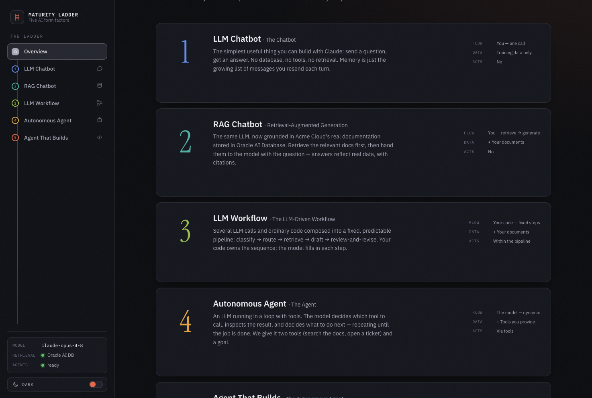
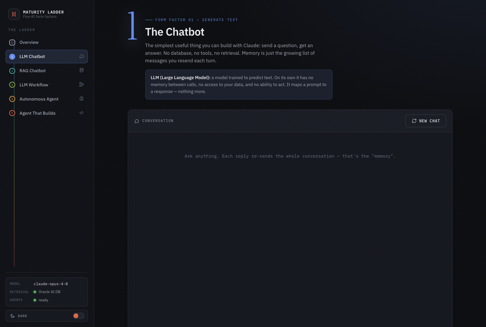
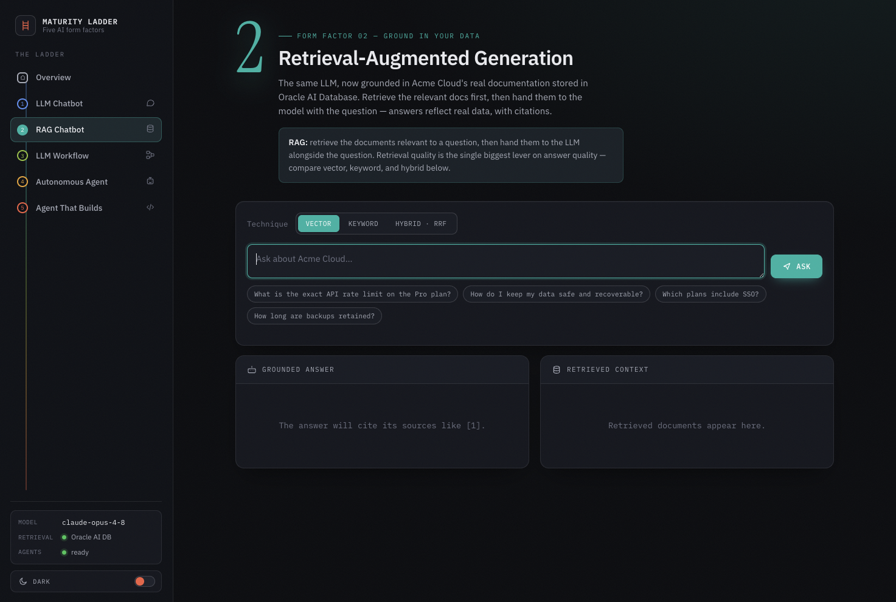
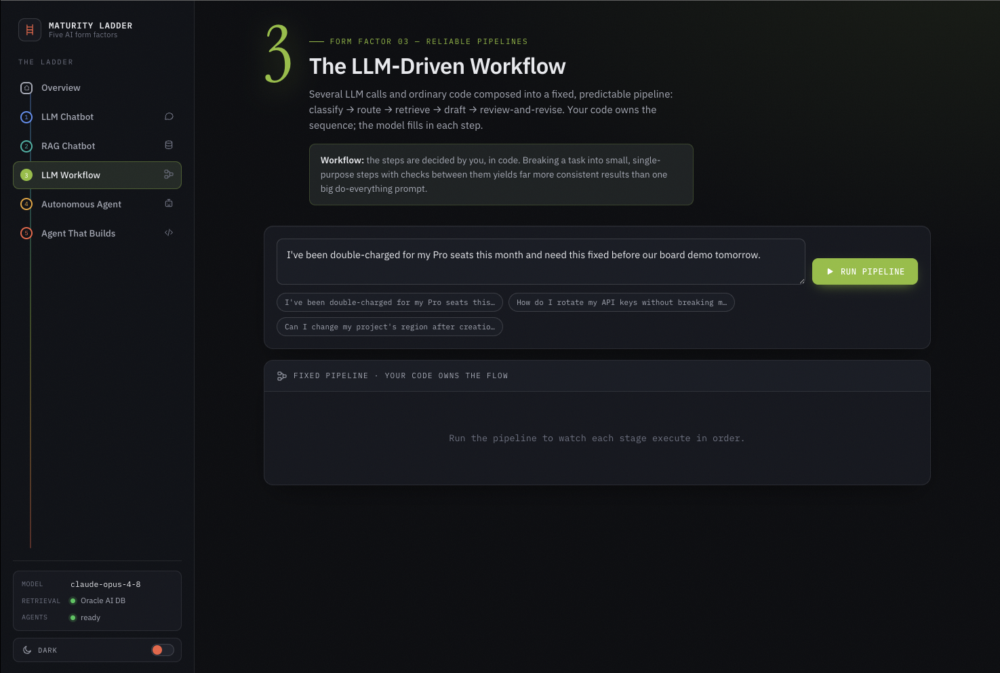
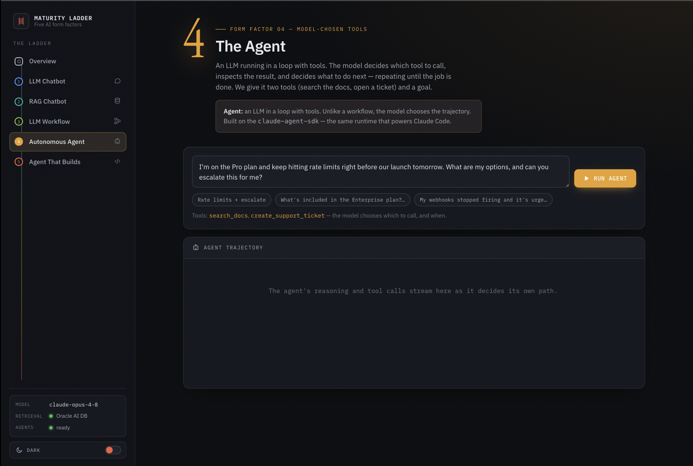
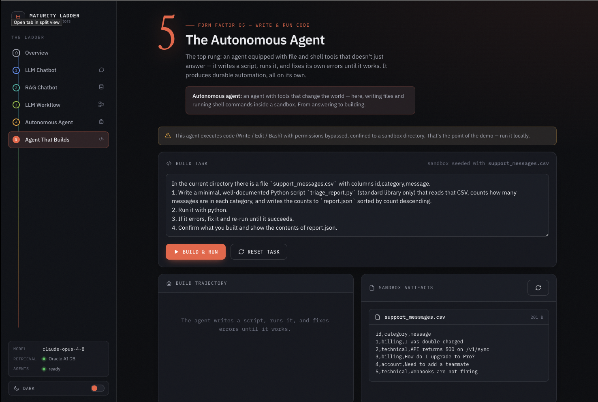

# The AI Maturity Ladder — App

A FastAPI + vanilla-JS application that turns the
[`ai_maturity_form_factors_complete.ipynb`](../ai_maturity_form_factors_complete.ipynb) workshop
into an interactive, sleek (light/dark) web app. The sidebar is a literal ladder:
each rung is one of the five AI form factors, climbing from a plain chatbot to an
autonomous agent that writes and runs its own code.



| # | Form factor | Page | What it shows |
|---|-------------|------|----------------|
| 1 | **LLM Chatbot** | `#/chatbot` | Multi-turn chat; "memory" = the growing message list re-sent each turn (streamed). |
| 2 | **RAG Chatbot** | `#/rag` | Retrieval (vector / keyword / hybrid) + a grounded, cited answer. Oracle AI Database, or in-memory fallback. |
| 3 | **LLM Workflow** | `#/workflow` | Fixed pipeline — classify → route → retrieve → draft → review/revise — streamed stage by stage. |
| 4 | **Autonomous Agent** | `#/agent` | A tool-using agent (`search_docs`, `create_support_ticket`); the model chooses the path. |
| 5 | **Agent That Builds** | `#/builder` | Writes a Python script, runs it, fixes its own errors in a sandbox; inspect the artifacts. |

<details>
<summary><b>Screens — one per form factor</b></summary>

**1 · LLM Chatbot** &nbsp; 

**2 · RAG Chatbot** &nbsp; 

**3 · LLM Workflow** &nbsp; 

**4 · Autonomous Agent** &nbsp; 

**5 · Agent That Builds** &nbsp; 

</details>

## Run

```bash
# from this directory
./run.sh
# → http://127.0.0.1:8000
```

`run.sh` activates the **`dbtlabs`** conda env (Python 3.13), which already has
`anthropic`, `oracledb`, `fastembed`, `claude-agent-sdk`, `uvicorn`, and
`sse-starlette`; it installs `fastapi` if missing. Or manually:

```bash
conda activate dbtlabs
pip install "fastapi>=0.110"
uvicorn backend.main:app --reload --port 8000   # run from app/
```

## Requirements & graceful degradation

- **`ANTHROPIC_API_KEY`** — required. Read from `app/.env`, or the workshop's
  existing `../.env` / `../../.env`. Model defaults to `claude-opus-4-8`.
- **Oracle AI Database** — optional. The app tries to connect (creating the
  `acme_docs` table, vector + text indexes, and ingesting the 12 docs, exactly
  like the notebook). If unreachable it falls back to an **in-memory NumPy**
  cosine index. The active backend is shown in the sidebar and on the RAG page.
- **Claude Agent SDK + `claude` CLI** — required only for Form Factors 4 & 5.
  The backend locates the `claude` binary automatically. If it's missing, those
  two pages show an install hint and the rest of the app works normally.

## Architecture

```
app/
├── backend/
│   ├── main.py              FastAPI app; warms the retriever; serves the SPA
│   ├── config.py            env loading, model, Oracle creds, CLI discovery
│   ├── schemas.py           Pydantic request bodies
│   ├── core/
│   │   ├── anthropic_client.py   shared client, text_of, structured_json
│   │   ├── knowledge_base.py     the 12 Acme Cloud docs (verbatim)
│   │   ├── retrieval.py          VectorStore: Oracle + NumPy fallback
│   │   ├── agent_runtime.py      claude-agent-sdk → normalized SSE events
│   │   └── sse.py                EventSourceResponse helper
│   └── routers/             one per form factor + /api/health
└── frontend/                index.html · styles.css · app.js (no build step)
```

All five form factors stream their output to the browser over Server-Sent
Events. The frontend is a dependency-free single-page app (hash router, theme
toggle, SSE-over-`fetch`).

> ⚠️ **Form Factor 5 executes code.** The builder agent runs `Write`/`Edit`/`Bash`
> with permissions bypassed, confined to `backend/sandbox/` (reset and re-seeded
> with `support_messages.csv` on each run). Keep it local.
