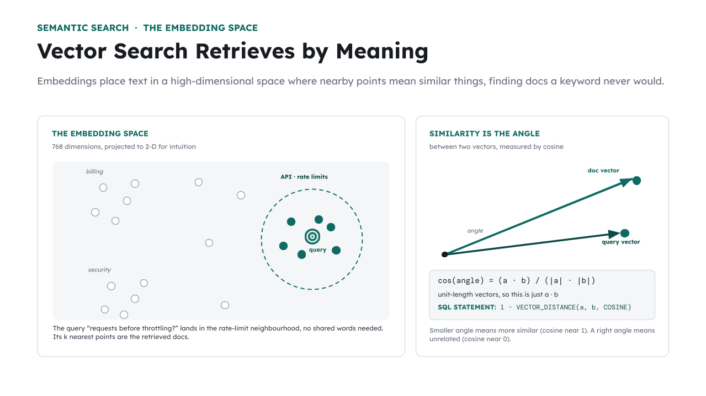

# 🧩 TODO 2 — Semantic search with Oracle vectors



Keyword search matches *words*. **Vector search** matches *meaning*: every document was embedded
into a 768-dimensional vector, and a question that means the same thing lands nearby — even with
no shared words. Oracle AI Database stores those vectors in a native `VECTOR` column and ranks
them with `VECTOR_DISTANCE`.

### What to implement
Write `vector_search(query, k)` to:
1. **Embed the query** with the *same* model used for the documents: `q = embed_query(query)`.
2. Run SQL that scores every row by cosine similarity and takes the top `k`:
   - select `doc_id, title, category` and `ROUND(1 - VECTOR_DISTANCE(embedding, :q, COSINE), 4)`
     as the similarity (distance → similarity is `1 - distance`),
   - `ORDER BY similarity DESC FETCH FIRST k ROWS ONLY`.
3. Execute it (`cur.execute(sql, q=q)`) and **return `(rows, column_names)`** — return
   `cur.fetchall()` and `[d[0] for d in cur.description]`.

> 💡 Embedding the query with a *different* model than the documents is the #1 RAG bug — the two
> vector spaces don't line up and similarity becomes meaningless.

## ✅ Solution

Replace the placeholder cell with this, then run the **`✅ TODO 2 check`** cell:

```python
def vector_search(query: str, k: int = 5):
    q = embed_query(query)
    sql = f"""
        SELECT doc_id, title, category,
               ROUND(1 - VECTOR_DISTANCE(embedding, :q, COSINE), 4) AS similarity
        FROM acme_docs
        ORDER BY similarity DESC
        FETCH FIRST {int(k)} ROWS ONLY
    """
    with conn.cursor() as cur:
        cur.execute(sql, q=q)
        return cur.fetchall(), [d[0] for d in cur.description]
```

_Generated from the complete notebook — this is the exact reference implementation._
