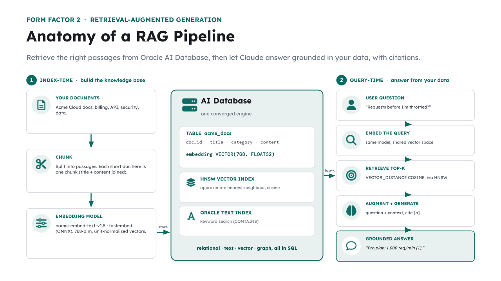

# 🧩 TODO 3 — A grounded, cited RAG answer



**RAG = Retrieve, then Generate.** Instead of hoping the model knows your private facts, you fetch
the relevant documents and hand them to the model *inside the prompt*, with strict instructions to
answer **only** from that material and to **cite** its sources. This grounds the answer in real
data and makes it auditable.

### What to implement
Write `rag_answer(query, k)` to:
1. **Retrieve** the top-k passages: `hits = retrieve(query, k)` (each hit is `(doc, score)`).
2. **Build a numbered context** so the model can cite by number:
   `context = "\n".join(f"[{i+1}] {doc}" for i, (doc, _) in enumerate(hits))`.
3. **Compose a system prompt** that includes the context and says: answer using ONLY the context,
   cite with bracketed numbers like `[1]`, and admit when the answer isn't present.
4. **Call the model** with that system prompt and the user's `query`, and **return** `text_of(response)`.

> 💡 The instruction "if it's not in the context, say you don't have it" is what turns a
> confident hallucinator into a trustworthy assistant.

## ✅ Solution

Replace the placeholder cell with this, then run the **`✅ TODO 3 check`** cell:

```python
def rag_answer(query: str, k: int = 3) -> str:
    """Form Factor 2: retrieve from Oracle, then generate a grounded, cited answer."""
    hits = retrieve(query, k)
    context = "\n".join(f"[{i + 1}] {doc}" for i, (doc, _) in enumerate(hits))

    system = (
        "You are the Acme Cloud support assistant. Answer the question using ONLY the "
        "context below. Cite the sources you use with bracketed numbers like [1]. "
        "If the answer is not in the context, say you don't have that information.\n\n"
        f"Context:\n{context}"
    )
    response = client.messages.create(
        model=MODEL,
        max_tokens=MAX_TOKENS,
        system=system,
        messages=[{"role": "user", "content": query}],
    )
    return text_of(response)


# The same question that stumped the bare chatbot — now grounded in Oracle-backed docs:
print(rag_answer("What is the exact API rate limit, in requests per minute, on Acme Cloud's Pro plan?"))
```

_Generated from the complete notebook — this is the exact reference implementation._
