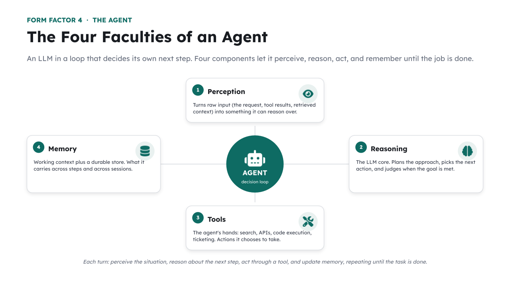

# 🧩 TODO 6 — Give the agent a tool



An **agent** is an LLM in a loop with tools — *it* decides which tool to call and when. Your job is
to hand it good tools. The `@tool` decorator turns an ordinary async function into one the agent
can invoke; the **description** is how the model knows when to reach for it, so write it well.

### What to implement
Fill in the body of `search_docs(args)` (keep the `@tool(...)` decorator above it):
1. **Retrieve** for the agent's query: `hits = retrieve(args["query"], k=3)` — reusing the same
   RAG retriever from Form Factor 2.
2. **Format** the hits as a numbered string the model can cite:
   `text = "\n".join(f"[{i+1}] {doc}" for i, (doc, _) in enumerate(hits))`.
3. **Return tool content** in the expected shape:
   `return {"content": [{"type": "text", "text": text}]}`.

> 💡 Notice you are *not* writing any `if`/`for` logic to decide when to search — the agent does
> that itself, based on your tool's description.

## ✅ Solution

Replace the placeholder cell with this, then run the **`✅ TODO 6 check`** cell:

```python
@tool(
    "search_docs",
    "Search the Acme Cloud documentation. Use this whenever the user asks about Acme "
    "Cloud's plans, pricing, limits, or features.",
    {"query": str},
)
async def search_docs(args):
    hits = retrieve(args["query"], k=3)            # reuse the RAG retriever from Form Factor 2
    text = "\n".join(f"[{i + 1}] {doc}" for i, (doc, _) in enumerate(hits))
    return {"content": [{"type": "text", "text": text}]}
```

_Generated from the complete notebook — this is the exact reference implementation._
